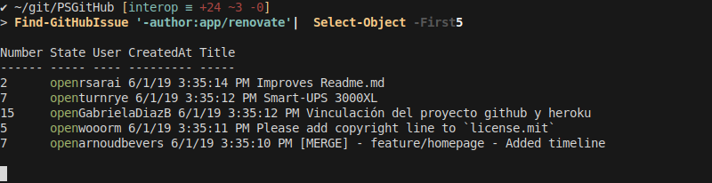
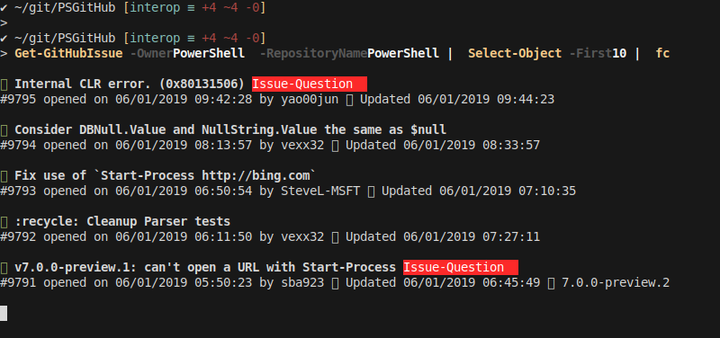
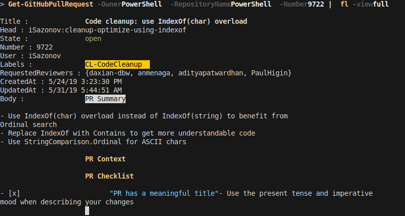
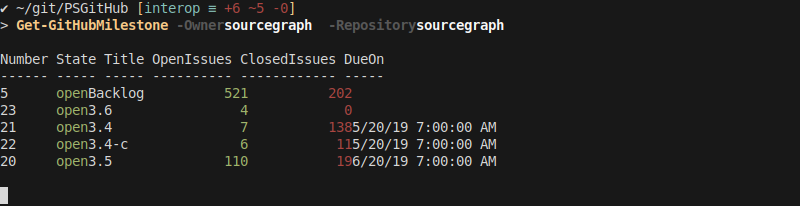
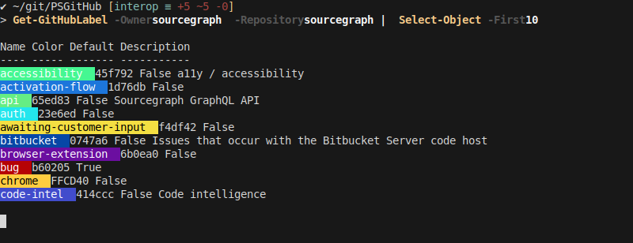
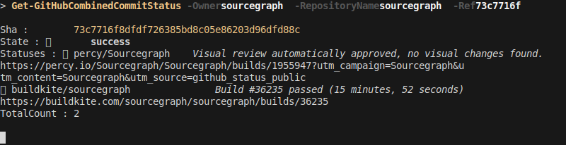
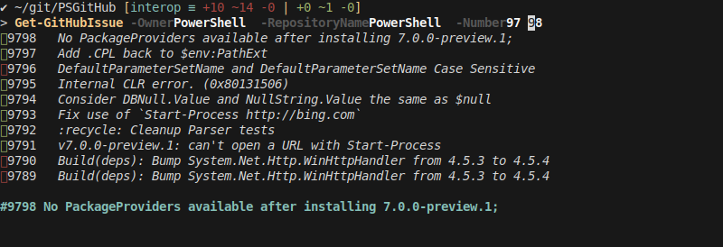

# PSGitHub

[](https://www.powershellgallery.com/packages/PSGitHub)
[](https://www.powershellgallery.com/packages/PSGitHub)
[](https://ci.appveyor.com/project/pcgeek86/psgithub)
[](https://gitter.im/pcgeek86/PSGitHub?utm_source=badge&utm_medium=badge&utm_campaign=pr-badge&utm_content=badge)

PowerShell module with commands to query and manage GitHub through its REST API.

## Installation

You can install the PSGitHub PowerShell module using one of the following methods.

1. Install from the PowerShell Gallery (requires PowerShell 5.0+)
   ```powershell
   Install-Module PSGitHub
   ```
2. Copy-install the module to your `$env:PSModulePath`
3. Extract the module anywhere on the filesystem, and import it explicitly, using `Import-Module`

## Setup

To access private repositories, make changes and have a higher rate limit,
[create a GitHub token](https://github.com/settings/tokens/new). This token can be provided to all PSGitHub
functions as a `SecureString` through the `-Token` parameter. You can set a default token to be used by
changing `$PSDefaultParameterValues` in your `profile.ps1`:

### On Windows

```powershell
$PSDefaultParameterValues['*GitHub*:Token'] = 'YOUR_ENCRYPTED_TOKEN' | ConvertTo-SecureString
```

To get the value for `YOUR_ENCRYPTED_TOKEN`, run `Read-Host -AsSecureString | ConvertFrom-SecureString` once
and paste in your token.

### On macOS/Linux

macOS and Linux do not have access to the Windows Data Protection API, so they cannot use
`ConvertFrom-SecureString` to generate an encrypted plaintext version of the token without a custom encryption
key.

If you are not concerned about storing the token in plain text in the `profile.ps1`, you can set it like this:

```powershell
$PSDefaultParameterValues['*GitHub*:Token'] = 'YOUR_PLAINTEXT_TOKEN' | ConvertTo-SecureString -AsPlainText -Force
```

Alternatively, you could store the token in a password manager or the Keychain, then retrieve it in your
profile and set it the same way.

## Features

### Included Cmdlets

<!--
Generate rows with

Get-Command -Name *-GitHub* -CommandType Function | Group-Object -Property { ($_.Name -split '-')[1] } | ForEach-Object { "| $(($_.Group | ForEach-Object { ($_.Name -split '-')[0] }) -join ', ') | $($_.Name -replace 'GitHub','') |" }
-->

| Supported Verbs                | GitHub Resource      |
| ------------------------------ | -------------------- |
| Add, Get                       | Assignee             |
| Get                            | CombinedCommitStatus |
| Get, New                       | Comment              |
| Start                          | Fork                 |
| Get, New, Remove, Save, Update | Gist                 |
| Remove                         | GitRef               |
| Find, Get, New, Update         | Issue                |
| Get                            | IssueTimeline        |
| Find, Get, New, Remove, Update | Label                |
| Get                            | License              |
| Get                            | Milestone            |
| Get                            | Organization         |
| Get                            | Project              |
| Get, Move, New                 | ProjectCard          |
| Get                            | ProjectColumn        |
| Get, Merge, New                | PullRequest          |
| Get                            | RateLimit            |
| Get, New                       | Release              |
| Get, New, Remove               | ReleaseAsset         |
| Find, Get, New, Remove         | Repository           |
| New, Submit                    | Review               |
| New                            | ReviewRequest        |
| Get                            | Team                 |
| Get                            | TeamMember           |
| Set                            | Token                |
| Find, Get, Update              | User                 |

### Pretty Formatting

PSGitHub includes pretty, colored output formatting. Different views are available when piping to different
`Format-*` cmdlets (`Format-Table`, `Format-List`, `Format-Custom` and `Format-Wide`) and specifying the
`-View` parameter. Markdown in issue bodies and comments is highlighted as well.

#### Issues & Pull Requests

##### `Format-Table` (default)



##### `Format-Custom`



##### `Format-List -View Full`

Includes colored labels and rendered markdown.



#### Milestones



#### Labels



Labels also support `Format-Wide`.

#### Commit Statuses



### Autocompletion

There is autocompletion for almost all parameters, namely `-Owner`, `-RepositoryName`, `-Number` (issue
numbers), `-Label`, `-Assignee`, `-MilestoneName`. Search keywords in `Find-Github*` queries also have
autocompletion.



### Pipeline Support

All cmdlets have pipeline support. This means you can take the output of one cmdlet like `Find-GitHubIssue`
and pipe it into another like `Update-GitHubIssue`.

```powershell
# Close all wont-fix issues
Find-GitHubIssue "is:open label:wont-fix" | Update-GitHubIssue -State closed
```

PSGitHub is also designed to interoperate with [PowerGit](https://github.com/felixfbecker/PowerGit). This
means for example that you can pipe a PowerGit branch object into `New-GitHubPullRequest` to open a new pull
request from that branch (`Get-GitHubPullRequest` and `Merge-GitHubPullRequest` work equally). At the minimum,
piping any PowerGit object (repository, branch, commit, remote, etc) will fill the `-Owner` and
`-RepositoryName` parameters.

```powershell
# Opening a new PR for a new branch
New-GitBranch my-branch | Send-GitObject | New-GitHubPullRequest

# Merging the PR of the current branch
Get-GitHead | Merge-GitHubPullRequest -WaitForStatusChecks

# Clone a GitHub repository
Get-GitHubRepository -RepositoryName foo | Copy-GitRepository
```

### Pagination

Pagination is automatic. Every cmdlet that queries collections will keep making requests for new pages and
emit objects until the end is reached. To limit the number of results, pipe to `Select-Object -First`.

### Types

All objects returned are raw GitHub API responses, however with assigned TypeNames, which have Types.ps1xml
files. They are extended with several additional properties, for example aliasing all snake_cased properties
to PascalCase for consistency with PowerShell naming conventions.

## Contributing

### SVG Screenshots

SVG Screenshots are created with [term2svg](https://github.com/nbedos/termtosvg)

```powershell
termtosvg ./Screenshots/frames -s -g 100x12 -t base16_default_dark -c 'pwsh -NoExit -Command clear'
```

`-s` outputs still .svg frames. Always use the `base16_default_dark` theme for consistency. Keep the column
width at 100 for best readability in the README (resize your terminal to match the width). If 12 is not enough
the row height should be matched to the output of the command. Execute your command, then execute `exit`. Pick
the frame that shows the command output but does not show the next prompt.

## Issues

Please report issues in the GitHub Issue Tracker.

## Contributors

This module was originally developed by Trevor Sullivan. You can contact Trevor using one of the following
methods:

- E-mail: trevor@trevorsullivan.net
- Website: https://trevorsullivan.net
- Twitter: [@pcgeek86](https://twitter.com/pcgeek86)
- GitHub: [@pcgeek86](https://github.com/pcgeek86)

### Core Contributors

- Felix Becker
  - Twitter: [@felixfbecker](https://twitter.com/felixfbecker)
  - GitHub: [@felixfbecker](https://github.com/felixfbecker)
- Thomas Malkewitz
  - Skype: thomasmalkewitz
  - Twitter: [@dotps1](https://twitter.com/dotps1)
  - Website: https://dotps1.github.io
